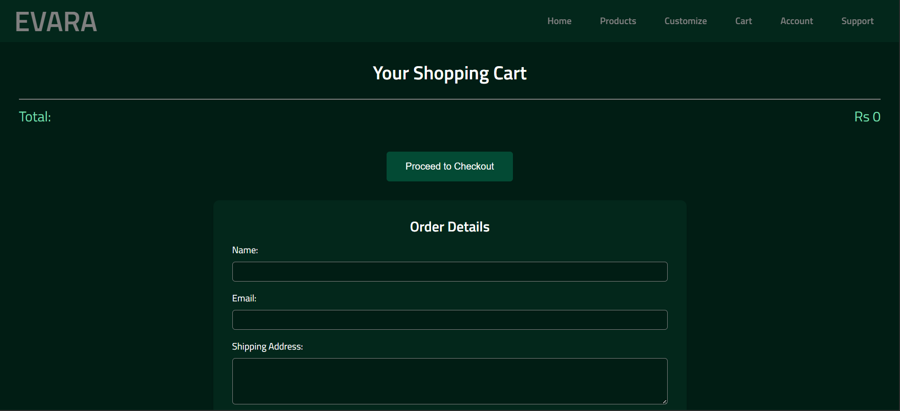
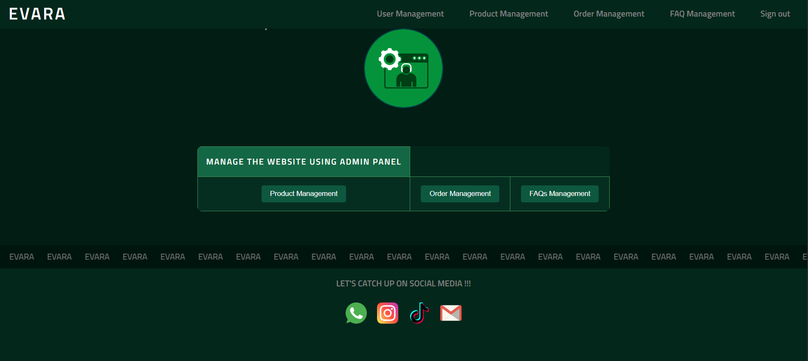

# 💎 EVARA - Personalized Jewelry E-Commerce Platform

<div align="center">


**EVARA** is a small full-stack e-commerce web app I built for a course assignment (1st Year, 2nd Semester). It lets customers browse and customize jewelry, place orders, and lets an admin manage products and orders. I built this to practise connecting a PHP backend to a MySQL database and to explore simple customization tools for product design.

[](https://www.php.net/)
[](https://www.mysql.com/)
[](https://developer.mozilla.org/en-US/docs/Web/HTML)
[](https://developer.mozilla.org/en-US/docs/Web/CSS)
[](https://developer.mozilla.org/en-US/docs/Web/JavaScript)

*Developed in 2024 | 1st Year, 2nd Semester | Individual Assessment Project*

</div>

---

## 📋 Table of Contents

- [Overview](#-overview)
- [What I built](#-features)
- [Tech stack](#-technology-stack)
- [Project Structure](#-project-structure)
- [How to run (quick)](#-installation--setup)
- [Database Schema](#-database-schema)
- [Key Functionalities](#-key-functionalities)
- [Screenshots](#-screenshots)
- [Future Enhancements](#-future-enhancements)
- [Author](#-author)
- [License](#-license)

---

## 🎯 Overview

EVARA is an educational project that demonstrates a working e-commerce flow: product browsing, simple customization (e.g., engraving or selecting materials), cart management, and order handling. There's a lightweight admin dashboard for CRUD operations and FAQ management.

### Project Highlights

-  **Full-Stack Development**: Complete integration of frontend and backend
-  **User Authentication**: Secure login/signup system with role-based access
-  **E-Commerce Functionality**: Shopping cart, order management, and checkout
-  **Admin Dashboard**: Comprehensive admin panel for website management
-  **Database-Driven**: MySQL database with proper relationships and constraints
-  **Responsive Design**: Mobile-friendly interface with modern UI/UX
-  **Security**: Prepared statements to prevent SQL injection attacks

---

## 📊 Features

### Customer Features
-  **Product Browsing**: Browse jewelry by categories (Gold, Silver, Pearl)
-  **Customization Tools**: Design personalized jewelry pieces
-  **Shopping Cart**: Add, update, and remove items from cart
-  **Order Management**: Place orders with multiple payment options
-  **User Dashboard**: View profile and order history
-  **Support System**: Contact form and FAQ section

### Admin Features
-  **Product Management**: Add, edit, and delete products
-  **Order Management**: View and update order statuses
-  **User Management**: Manage customer accounts
-  **FAQ Management**: Create and edit frequently asked questions
-  **Dashboard Overview**: Centralized admin control panel

### Technical Features
-  **Secure Authentication**: Password hashing with PHP password_hash()
-  **SQL Injection Prevention**: Prepared statements throughout
-  **Responsive Design**: Works on desktop, tablet, and mobile devices
-  **Session Management**: Secure session handling for user data
-  **AJAX Integration**: Dynamic cart updates without page reload

---

## 🛠️ Technology Stack

### Frontend
- **HTML5**: Semantic markup and structure
- **CSS3**: Modern styling with responsive design
- **JavaScript**: Interactive features and AJAX requests
- **Responsive Grid Layout**: CSS Grid and Flexbox

### Backend
- **PHP 8.2+**: Server-side scripting and logic
- **MySQL/MariaDB**: Relational database management
- **Session Management**: PHP sessions for user authentication

### Development Tools
- **XAMPP**: Local development environment
- **phpMyAdmin**: Database management interface
- **VS Code / Any IDE**: Code editor

---

## 📁 Project Structure

```
EVARA_SA23800946/
│
├── 📄 PHP Files (Frontend & Backend)
│   ├── index.php                 # Homepage
│   ├── product.php              # Product listing page
│   ├── cart.php                 # Shopping cart
│   ├── customize.php            # Customization page
│   ├── login.php                # Login page
│   ├── login_process.php        # Login authentication
│   ├── account.php              # User registration
│   ├── support.php              # Support & FAQ page
│   ├── user_dashboard.php       # Customer dashboard
│   ├── admin_dashboard.php      # Admin dashboard
│   ├── admin_product_management.php
│   ├── admin_order_management.php
│   ├── admin_user_management.php
│   ├── admin_faq_management.php
│   └── logout.php               # Session logout
│
├── 🎨 CSS/
│   ├── style.css                # Global styles
│   ├── index.css                # Homepage styles
│   ├── product.css             # Product page styles
│   ├── cart.css                 # Cart page styles
│   └── [other page styles]
│
├── 📜 JavaScript/
│   ├── cart.js                  # Cart functionality
│   ├── account.js               # Form validation
│   └── profile.js               # Profile management
│
├── 🗄️ Database/
│   └── evara_db.sql             # Database schema and data
│
└── 🖼️ pics/
    ├── gold/                    # Gold product images
    ├── silver/                  # Silver product images
    ├── pearl/                   # Pearl product images
    └── [other assets]
```

---

## 🚀 Installation & Setup

### Prerequisites
- [XAMPP](https://www.apachefriends.org/) (Apache + MySQL + PHP)
- Web browser (Chrome, Firefox, Edge)
- Code editor (optional)

### Step-by-Step Installation

1. **Clone the Repository**
   ```bash
   git clone https://github.com/Sbasnayaka/EVARA_SA23800946.git
   cd EVARA_SA23800946
   ```

2. **Start XAMPP Services**
   - Open XAMPP Control Panel
   - Start **Apache** and **MySQL** services

3. **Import Database**
   - Open phpMyAdmin: `http://localhost/phpmyadmin`
   - Create new database: `evara_db`
   - Import `Database/evara_db.sql` file

4. **Configure Database Connection** (if needed)
   - Default settings (already configured):
     - Server: `localhost`
     - Username: `root`
     - Password: `` (empty)
     - Database: `evara_db`

5. **Access the Application**
   - Open browser: `http://localhost/EVARA_SA23800946/`
   - Or: `http://localhost/EVARA_SA23800946/index.php`

### Default Test Accounts

**Admin Account:**
- Username: `Basnayaka`
- Password: (check database or create new)

**Customer Account:**
- Username: `Sanuu`
- Password: (check database or create new)

> **Note**: 
You can create new accounts through the registration page.

For detailed setup instructions, see [HOW_TO_RUN.md](HOW_TO_RUN.md)

---

## 🗄️ Database Schema

### Main Tables

- **users**: User accounts (customers and admins)
- **products**: Jewelry product catalog
- **cart**: Shopping cart items
- **orders**: Customer orders
- **order_items**: Order details and items
- **customizations**: Custom jewelry designs
- **faqs**: Frequently asked questions

### Key Relationships

- `orders.user_id` → `users.id`
- `order_items.order_id` → `orders.order_id`
- `order_items.product_id` → `products.product_id`

---

## 🔑 Key Functionalities

### Authentication System
- User registration with email validation
- Secure password hashing (bcrypt)
- Role-based access control (Customer/Admin)
- Session management

### E-Commerce Features
- Product catalog with categories
- Shopping cart with quantity management
- Order placement with payment options
- Order tracking and status updates

### Admin Panel
- CRUD operations for products
- Order status management
- User account management
- FAQ content management

### Security Features
- Prepared SQL statements (SQL injection prevention)
- Password encryption
- Input validation
- Session security

---

## 📸 Screenshots

> - **Homepage**
> - **Product page**
> - **Shopping cart**
> - **User dashboard**
> - **Admin dashboard**

**Example:**
```



[Customer](screenshots/customer.png)

```

---

## 🔮 Future Enhancements

- [ ] Payment gateway integration (Stripe, PayPal)
- [ ] Email notifications for orders
- [ ] Product search and filtering
- [ ] User reviews and ratings
- [ ] Wishlist functionality
- [ ] 3D jewelry visualization
- [ ] AI-powered design recommendations
- [ ] Multi-language support
- [ ] Advanced analytics dashboard
- [ ] Mobile app development

---

## 👨‍💻 Author

**Sanduni Basnayaka**

- **Project**: EVARA E-Commerce Platform
- **Year**: 2024
- **Academic**: 1st Year, 2nd Semester
- **Type**: Individual Assessment Project

### About This Project

This project represents my first complete full-stack web application. It was developed as an individual assessment during my first year of studies, demonstrating my understanding of web development fundamentals, database design, and software engineering principles.

**Key Learning Outcomes:**
- Full-stack development with PHP and MySQL
- Database design and normalization
- User authentication and session management
- E-commerce functionality implementation
- Security best practices
- Responsive web design

---

## 📄 License

This project is created for educational purposes as part of academic coursework.

---

## 🙏 Acknowledgments

- XAMPP Community for the development environment
- All open-source libraries and resources used
- Academic instructors for guidance and feedback

---

## 📞 Contact

For questions or feedback about this project, please feel free to reach out!

---

<div align="center">

**⭐ If you find this project interesting, please give it a star! ⭐**

Made with ❤️ in 2024

</div>

